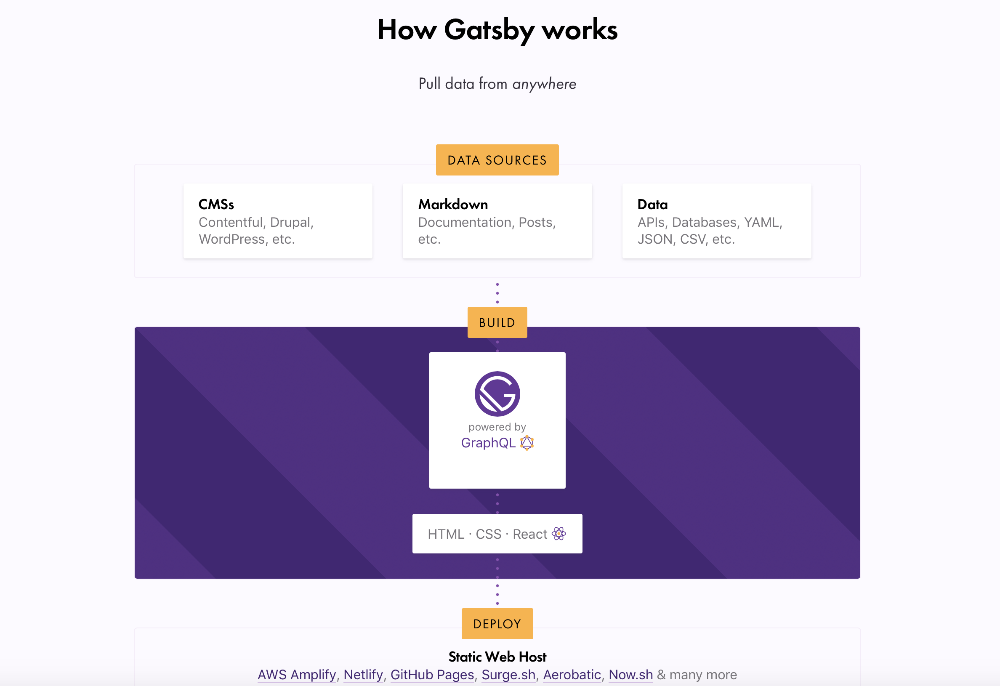

Gatsby.js - это SSG, который позволяет построить или перестроить pwa сайт с очень быстрой загрузкой страниц. Загрузка страниц целиком и переход между ними измеряется в миллисекундах, а не секундах.

Для контентных сайтов использование данного фреймворка приводит к
улучшению показателей по SEO, уменьшению кол-ва отказов устойчивости к большим нагрузкам.
Для интернет магазинов с pre-fetch'ингом страниц пользователи мнгновенно перемещаются по страницам сайта, быстрее находят формы заявок даже на медленном мобильном соединении, что для ecommerce прямым образом влияет на конверсию лидов.

- Быстрая скорость загрузки страниц

- Теперь не нужно обращаться к экспертам в области настройки сверхбыстрого сайта.

Как было раньше: блогер или владелец интернет-магазина устанавливает сайт на cms на хостинг. Блог или магазин начинает раскручиваться, скорость загрузки страниц сайта замедляется, позиции по SEO и продажам падают и приходится обращаться к экспертам за такими процедурами как:

- оптимизация запросов в БД по скорости
  покупка/настройка мощных серверов для обработки большого кол-ва запросов БД и веб-приложений-
  настройка гигагитных портов между серверами
  выкручивание параметров nginx, настройка кэширования и подключения cdn для отдельных ресурсов.
  В конце этого пути чаще всего приходит понимание того, что с ростом ресурса нужно отказываться от cms и переходить на какую-то кастомную разработку, если хочется быстрой загрузки/разработки и вообще остаться в бизнесе.

С Gatsby.js все изменилось, так как данный фреймворк проводит сборку проекта в файлы которые могут быть размещены/доступны на любом ФАЙЛОВОМ хостинге и скорость загрузки сайта будет молниеносной.

- Простота использования. Без серверов. Без баз данных.

- Размещение сайта со стандартной архитектурой (веб-приложение на php или cms+БД) на хостинге затратен по деньгам и времени на настройку и всегда есть риск отказа в случае если контент "зайдет", пойдет большой трафик, будет большое кол-во запросов.

- При размещении сайта со стандартной архитектурой (веб-приложение на php или cms+БД) обычно требуется зайти в консоль управления хостингом, создать бд, пользователей/права, решить вопрос подключения: будет ли БД доступна извне или локально. По нашему опыту такая БД обычно справляется с небольшим кол-вом соединений(по умолчанию 50) и естественно имеет ограничение по скорости в зависимости от хостинга.

Gatsby полностью это решает с serverless архитектурой. Такой сайт никогда не падает от таких скачков.

- BYOC (Bring your own content) - использование своих источников данных

Применение новых фреймворков в существующих проектах обычно ограничено в связи с тем, что приходится создавать проект с нуля. С Gatsby это не совсем так. Gatsby отлично работает с существующими cms: Wordpress, Drupal, Contentful, Shopify, etc. Кроме того источниками для сайта могут быть markdown файлы, csv.
Также есть поддержка Restful API, GraphQL.

