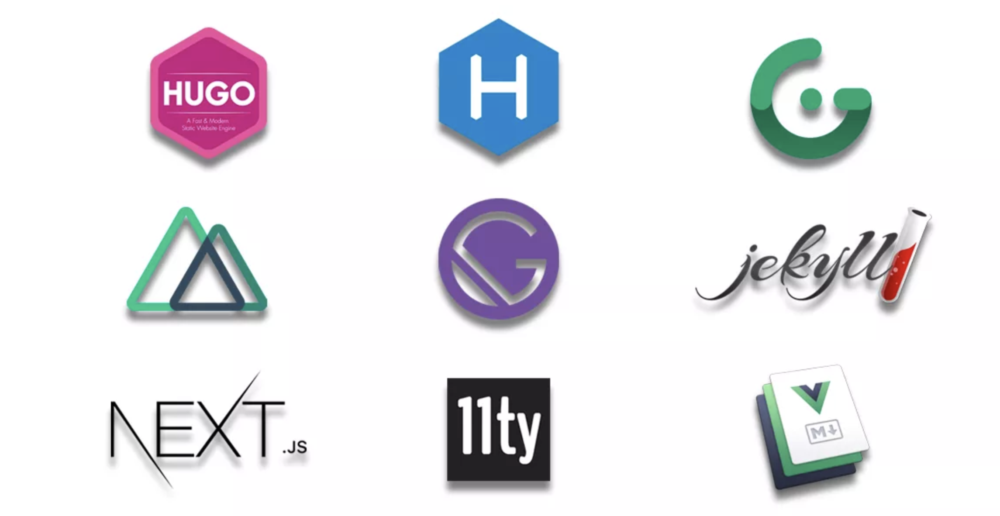

Что означает слово «JAM»? На официальном сайте мы найдем расшифровку: это аббревиатура из заглавных букв трех основных составляющих этой технологии:

JavaScript: любое динамическое программирование в процессе цикла запрос/ответ обрабатывается JavaScript, полностью выполняется на стороне клиента.

API: абстрование на стороне сервера всех функции или действий с базой данных в API, который повторно используется и доступ к которому осуществляется с помощью JS по протоколу HTTPS. Будь то SaaS (software as a service — одна из форм облачных вычислений, модель обслуживания, предоставляющая подписчикам готовое прикладное программное обеспечение, которое полностью обслуживается провайдером), сторонние сервисы или созданные самостоятельно.

Разметка: шаблонная разметка выполняется предварительно, обычно с использованием генератора сайтов для контентных сайтов или инструмента сборки для веб-приложений.

Что все это означает на практике?

«Общим для всех сайтов JAMstack является то, что они не зависят от веб-сервера».

Долгое время использование связанной CMS было нормой: в ней сосредоточен процесс управления и разработки, она дает клиентам автономию для управления своим сайтом.

Но это было 5+ лет назад.

С тех пор с увеличением числа владельцев мобильных устройств и изменением требований к функциональной стороне сайтов проблемы, связанные со скоростью работы сайтов с CMS стали приоритетными. Попытки разработчиков соответствовать новым требованиям приводят к тому, что сайты с CMS (WordPress, Drupal) становятся громоздкими и сложными в управлении. А минимальный эффект от оптимизации не стоит таких колоссальных трудозатрат.

Современные браузеры, генераторы статических сайтов, CDN и API позволлили веб-разработчикам перейти от создания динамических серверных приложений к модульным стекам на стороне клиента.

JAMstack сместил фокус с абстрактного бэкэнда к мощному веб-интерфейсу.

Чтобы новичку было проще понять принцип, как работает проект JAMstack, вот самая простая схема:

Автоматизированная сборка: разметка Jamstack предварительно собрана, изменения содержимого не будут запущены, пока вы не запустите другую сборку.
Весь сайт/приложение на CDN, что открывает скорость и производительность.
«Aтомарное развертывание», при котором никакие изменения не вступают в силу до тех пор, пока все измененные файлы не будут загружены
Мгновенное аннулирование кэша.
Все живет в Git, что упрощает организацию и тестирование рабочих процессов.
Но это не появилось в один момент, а создавалось в течение нескольких последних лет.

Этапы развития
С момента появления в процессе роста JAMstack проходил такие этапы:

→ 2015 : Статические сайты постепенно возвращаются из руин ранних лет Интернета. Первые отрицатели CMS снова делают их «крутыми».

→ 2016 : Происходит естественная обратная реакция: статические сайты совсем не крутые — им не хватает слишком много функций, чтобы создавать что-либо кроме блогов. В это время небольшая группа энтузиастов-разработчиков создает «JAMstack» и постепенно продвигает его принципы в кругах разработчиков.

→ 2017 : JAMstack имеет уже небольшое нишевое сообщество. Статические сайты больше не являются «статичными» как таковыми. Эта современная веб-революция предоставила все функции, необходимые для создания «гипер-динамических» сайтов и приложений. Sequoia Capital, Mailchimp & Red Bull являются одними из первых крупных предприятий, создавших проекты JAMstack.

→ 2018 : Вот фраза, которую часто можно было слышать в этот период: «Только что обнаружил JAMstack, и это потрясающе!». Gatsby, Netlify, Contentful и т.д. объявили о привлечении значительных средств финансирования.

→ 2019 : Год зрелости и общедоступности. JAMstack уже вырос за пределы нишевого сообщества. Большинство разработчиков интерфейсов узнают об этой технологии, и многие начинают изучать ее. Подобно Stackbit, JAMstack открывает свои двери для менее технически подкованных пользователей. Количество серверных функций, позволяющих привнести больше бэкэнд-функций в проекты, ориентированные на интерфейс, также огромно.

Stackbit — это новый SaaS, рассчитанный на разработчиков любого уровня, который позволяет быстро создавать собственные сайты JAMstack.

Stackbit имеет полный комплект инструментов, которые нужны для стека сайта (темы, статический генератор сайтов, CMS и развертывание), и связывает их вместе. Он предлагает возможность выбора вариантов в каждой категории, так что можно комбинировать и подбирать инструменты в стеке, которые оптимально подходят вашим потребностям.

→ 2020: в начале нового десятилетии ничто не указывает на снижение уровня принятия JAMstack. Если сервисы и API-интерфейсы в экосистеме продолжат показывать свою жизнеспособность и прибыльность, мы увидим, как более важные игроки будут придерживаться этой идеи, еще больше увеличивая принятие. Обеспокоенность большинства обозревателей сферы веб-разработки по поводу слишком большого количества вариантов JAMstack в ней говорит лишь о том, что будущее JAMstack-eров выглядит ярко!

Можно констатировать, что в мире веб-разработки происходят серьезные тектонические сдвиги: традиционный подход, который по догматизму не уступал закону Ньютона и правил миром веб-разработки более десяти лет, сегодня уже не считается единственно возможным.

Сравнение рабочих процессов (JAMstack и традиционный)
Вот простой пример, который поможет понять главные различия между двумя этими подходами:
